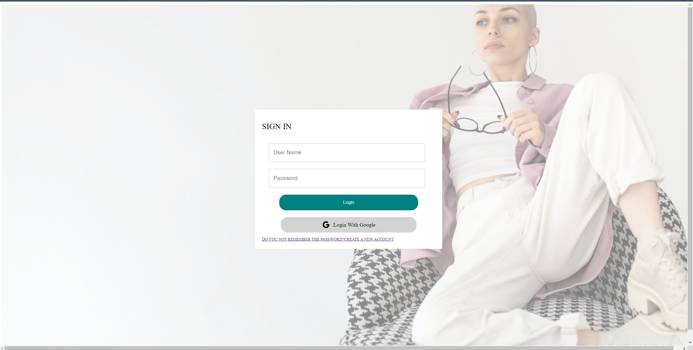
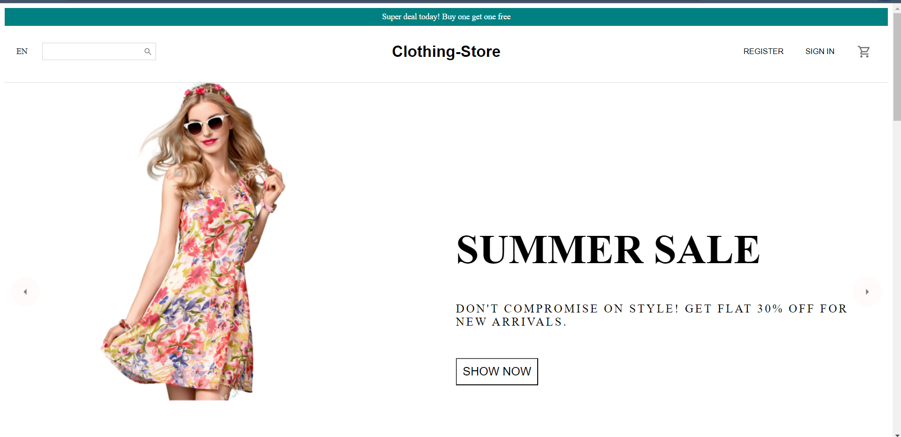
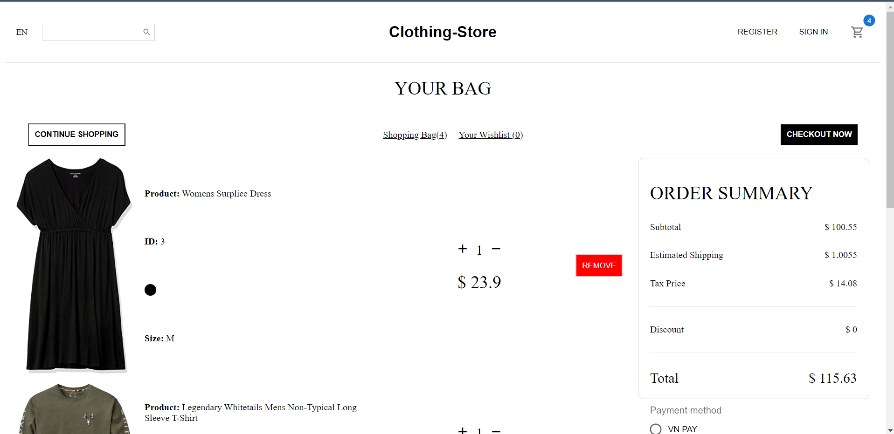

# Full Stack Clothing Store Project

This is a full stack clothing store project that includes both the frontend and backend implementations. The frontend is developed using ReactJS with Material UI for UI components, while the backend is built with Spring Boot, utilizing Spring Data JPA and Spring Security. The project also integrates MySQL as the database management system. The application incorporates security features, including JWT (JSON Web Token) and OAuth2 for Google login.

## Demo

## Features

- User Authentication: Users can register, log in, and manage their accounts securely.
- Product Catalog: The application provides a catalog of clothing products for users to browse and search.
- Shopping Cart: Users can add products to their shopping cart, review the cart, and proceed to checkout.
- Order Management: The system allows users to place orders and track their order history.
- Security with JWT: JSON Web Tokens are used for authentication and authorization, ensuring secure access to protected resources.
- OAuth2 with Google: Users have the option to log in using their Google accounts, leveraging OAuth2 for seamless integration.

## Technologies Used

- ReactJS
- Material UI
- Spring Boot
- Spring Data JPA
- Spring Security
- MySQL
- JWT
- OAuth2

## Installation and Setup

1. Clone the repository: `git clone https://github.com/kidhood/clothing-store`
2. Navigate to the project directory: `cd clothing-store-project`
3. Set up the MySQL database and configure the connection details in the project's configuration files.
4. Obtain the necessary credentials and configuration for OAuth2 with Google.
5. Build and run the backend application using Maven or your preferred IDE.
6. Navigate to the frontend directory: `cd frontend`
7. Install the required dependencies: `npm install`
8. Start the frontend development server: `npm start`

The application will now be running locally, and you can access it through your web browser.

## API Documentation

[Provide a link to the API documentation if available.]

## Contributors

This project was created by kidhood (Nguyễn Văn Thống). Contributions to the project are welcome. Feel free to submit bug reports, feature requests, or pull requests to enhance the functionality of the clothing store project.

If you have any questions or need further assistance, please don't hesitate to contact us.

